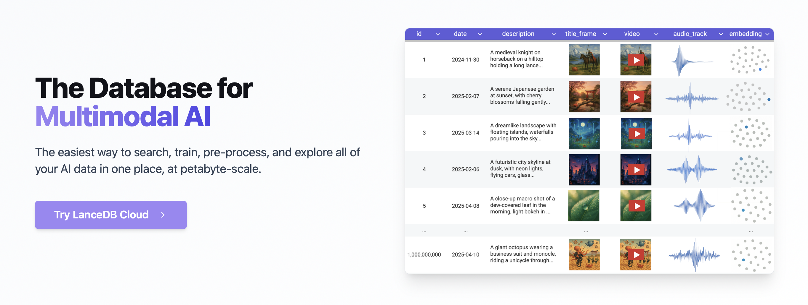

# **The Multimodal AI Lakehouse**

[**How to Install** ](#how-to-install) ✦ [**Detailed Documentation**](https://lancedb.github.io/lancedb/) ✦ [**Tutorials and Recipes**](https://github.com/lancedb/vectordb-recipes/tree/main) ✦  [**Contributors**](#contributors) 

**The ultimate multimodal data platform for AI/ML applications.** 

LanceDB is designed for fast, scalable, and production-ready vector search. It is built on top of the Lance columnar format. You can store, index, and search over petabytes of multimodal data and vectors with ease. 
LanceDB is a central location where developers can build, train and analyze their AI workloads.

 

## **Demo: Multimodal Search by Keyword, Vector or with SQL**

## **Star LanceDB to get updates!**

⭐ Click here ⭐  to see how fast we're growing!

<picture>
  <source media="(prefers-color-scheme: dark)" srcset="https://api.star-history.com/svg?repos=lancedb/lancedb&theme=dark&type=Date">
  
</picture>

## **Key Features**:

- **Fast Vector Search**: Search billions of vectors in milliseconds with state-of-the-art indexing.
- **Comprehensive Search**: Support for vector similarity search, full-text search and SQL.
- **Multimodal Support**: Store, query and filter vectors, metadata and multimodal data (text, images, videos, point clouds, and more).
- **Advanced Features**: Zero-copy, automatic versioning, manage versions of your data without needing extra infrastructure. GPU support in building vector index.

### **Products**:
- **Open Source & Local**: 100% open source, runs locally or in your cloud. No vendor lock-in.
- **Cloud and Enterprise**: Production-scale vector search with no servers to manage. Complete data sovereignty and security.

### **Ecosystem**:
- **Columnar Storage**: Built on the Lance columnar format for efficient storage and analytics.
- **Seamless Integration**: Python, Node.js, Rust, and REST APIs for easy integration. Native Python and Javascript/Typescript support.
- **Rich Ecosystem**: Integrations with [**LangChain** 🦜️🔗](https://python.langchain.com/docs/integrations/vectorstores/lancedb/), [**LlamaIndex** 🦙](https://gpt-index.readthedocs.io/en/latest/examples/vector_stores/LanceDBIndexDemo.html), Apache-Arrow, Pandas, Polars, DuckDB and more on the way.

## **How to Install**:

Follow the [Quickstart](https://lancedb.github.io/lancedb/basic/) doc to set up LanceDB locally. 

**API & SDK:** We also support Python, Typescript and Rust SDKs

| Interface | Documentation |
|-----------|---------------|
| Python SDK | https://lancedb.github.io/lancedb/python/python/ |
| Typescript SDK | https://lancedb.github.io/lancedb/js/globals/ |
| Rust SDK | https://docs.rs/lancedb/latest/lancedb/index.html |
| REST API | https://docs.lancedb.com/api-reference/introduction |

## **Join Us and Contribute**

We welcome contributions from everyone! Whether you're a developer, researcher, or just someone who wants to help out. 

If you have any suggestions or feature requests, please feel free to open an issue on GitHub or discuss it on our [**Discord**](https://discord.gg/G5DcmnZWKB) server.

[**Check out the GitHub Issues**](https://github.com/lancedb/lancedb/issues) if you would like to work on the features that are planned for the future. If you have any suggestions or feature requests, please feel free to open an issue on GitHub. 

## **Contributors**

## **Stay in Touch With Us**

 

