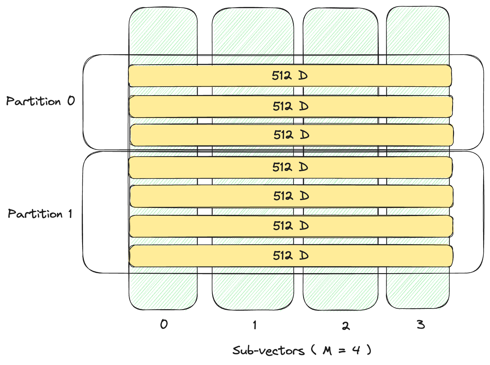

# Approximate Nearest Neighbor (ANN) Indexes

An ANN or a vector index is a data structure specifically designed to efficiently organize and
search vector data based on their similarity via the chosen distance metric.
By constructing a vector index, the search space is effectively narrowed down, avoiding the need
for brute-force scanning of the entire vector space.
A vector index is faster but less accurate than exhaustive search (kNN or flat search).
LanceDB provides many parameters to fine-tune the index's size, the speed of queries, and the accuracy of results.

## Disk-based Index

Lance provides an `IVF_PQ` disk-based index. It uses **Inverted File Index (IVF)** to first divide
the dataset into `N` partitions, and then applies **Product Quantization** to compress vectors in each partition.
See the [indexing](concepts/index_ivfpq.md) concepts guide for more information on how this works.

## Creating an IVF_PQ Index

Lance supports `IVF_PQ` index type by default.

=== "Python"

    Creating indexes is done via the [create_index](https://lancedb.github.io/lancedb/python/#lancedb.table.LanceTable.create_index) method.

    ```python
    import lancedb
    import numpy as np
    uri = "data/sample-lancedb"
    db = lancedb.connect(uri)

    # Create 10,000 sample vectors
    data = [{"vector": row, "item": f"item {i}"}
        for i, row in enumerate(np.random.random((10_000, 1536)).astype('float32'))]

    # Add the vectors to a table
    tbl = db.create_table("my_vectors", data=data)

    # Create and train the index - you need to have enough data in the table for an effective training step
    tbl.create_index(num_partitions=256, num_sub_vectors=96)
    ```

=== "TypeScript"

    === "@lancedb/lancedb"

        Creating indexes is done via the [lancedb.Table.createIndex](../js/classes/Table.md/#createIndex) method.

        ```typescript
        --8<--- "nodejs/examples/ann_indexes.ts:import"

        --8<-- "nodejs/examples/ann_indexes.ts:ingest"
        ```

    === "vectordb (deprecated)"

        Creating indexes is done via the [lancedb.Table.createIndex](../javascript/interfaces/Table.md/#createIndex) method.

        ```typescript
        --8<--- "docs/src/ann_indexes.ts:import"

        --8<-- "docs/src/ann_indexes.ts:ingest"
        ```

=== "Rust"

    ```rust
    --8<-- "rust/lancedb/examples/ivf_pq.rs:create_index"
    ```

    IVF_PQ index parameters are more fully defined in the [crate docs](https://docs.rs/lancedb/latest/lancedb/index/vector/struct.IvfPqIndexBuilder.html).

The following IVF_PQ paramters can be specified:

- **distance_type**: The distance metric to use. By default it uses euclidean distance "`L2`".
  We also support "cosine" and "dot" distance as well.
- **num_partitions**: The number of partitions in the index. The default is the square root
  of the number of rows.

!!! note

    In the synchronous python SDK and node's `vectordb` the default is 256. This default has
    changed in the asynchronous python SDK and node's `lancedb`.

- **num_sub_vectors**: The number of sub-vectors (M) that will be created during Product Quantization (PQ).
  For D dimensional vector, it will be divided into `M` subvectors with dimension `D/M`, each of which is replaced by
  a single PQ code. The default is the dimension of the vector divided by 16.

!!! note

    In the synchronous python SDK and node's `vectordb` the default is currently 96. This default has
    changed in the asynchronous python SDK and node's `lancedb`.

<figure markdown>
  
  <figcaption>IVF_PQ index with <code>num_partitions=2, num_sub_vectors=4</code></figcaption>
</figure>

### Use GPU to build vector index

Lance Python SDK has experimental GPU support for creating IVF index.
Using GPU for index creation requires [PyTorch>2.0](https://pytorch.org/) being installed.

You can specify the GPU device to train IVF partitions via

- **accelerator**: Specify to `cuda` or `mps` (on Apple Silicon) to enable GPU training.

=== "Linux"

    <!-- skip-test -->
    ``` { .python .copy }
    # Create index using CUDA on Nvidia GPUs.
    tbl.create_index(
        num_partitions=256,
        num_sub_vectors=96,
        accelerator="cuda"
    )
    ```

=== "MacOS"

    <!-- skip-test -->
    ```python
    # Create index using MPS on Apple Silicon.
    tbl.create_index(
        num_partitions=256,
        num_sub_vectors=96,
        accelerator="mps"
    )
    ```

Troubleshooting:

If you see `AssertionError: Torch not compiled with CUDA enabled`, you need to [install
PyTorch with CUDA support](https://pytorch.org/get-started/locally/).

## Querying an ANN Index

Querying vector indexes is done via the [search](https://lancedb.github.io/lancedb/python/#lancedb.table.LanceTable.search) function.

There are a couple of parameters that can be used to fine-tune the search:

- **limit** (default: 10): The amount of results that will be returned
- **nprobes** (default: 20): The number of probes used. A higher number makes search more accurate but also slower.<br/>
  Most of the time, setting nprobes to cover 5-10% of the dataset should achieve high recall with low latency.<br/>
  e.g., for 1M vectors divided up into 256 partitions, nprobes should be set to ~20-40.<br/>
  Note: nprobes is only applicable if an ANN index is present. If specified on a table without an ANN index, it is ignored.
- **refine_factor** (default: None): Refine the results by reading extra elements and re-ranking them in memory.<br/>
  A higher number makes search more accurate but also slower. If you find the recall is less than ideal, try refine_factor=10 to start.<br/>
  e.g., for 1M vectors divided into 256 partitions, if you're looking for top 20, then refine_factor=200 reranks the whole partition.<br/>
  Note: refine_factor is only applicable if an ANN index is present. If specified on a table without an ANN index, it is ignored.

=== "Python"

    ```python
    tbl.search(np.random.random((1536))) \
        .limit(2) \
        .nprobes(20) \
        .refine_factor(10) \
        .to_pandas()
    ```

    ```text
                                              vector       item       _distance
    0  [0.44949695, 0.8444449, 0.06281311, 0.23338133...  item 1141  103.575333
    1  [0.48587373, 0.269207, 0.15095535, 0.65531915,...  item 3953  108.393867
    ```

=== "TypeScript"

    === "@lancedb/lancedb"

        ```typescript
        --8<-- "nodejs/examples/ann_indexes.ts:search1"
        ```

    === "vectordb (deprecated)"

        ```typescript
        --8<-- "docs/src/ann_indexes.ts:search1"
        ```

=== "Rust"

    ```rust
    --8<-- "rust/lancedb/examples/ivf_pq.rs:search1"
    ```

    Vector search options are more fully defined in the [crate docs](https://docs.rs/lancedb/latest/lancedb/query/struct.Query.html#method.nearest_to).

The search will return the data requested in addition to the distance of each item.

### Filtering (where clause)

You can further filter the elements returned by a search using a where clause.

=== "Python"

    ```python
    tbl.search(np.random.random((1536))).where("item != 'item 1141'").to_pandas()
    ```

=== "TypeScript"

    === "@lancedb/lancedb"

        ```typescript
        --8<-- "nodejs/examples/ann_indexes.ts:search2"
        ```

    === "vectordb (deprecated)"

        ```javascript
        --8<-- "docs/src/ann_indexes.ts:search2"
        ```

### Projections (select clause)

You can select the columns returned by the query using a select clause.

=== "Python"

    ```python
    tbl.search(np.random.random((1536))).select(["vector"]).to_pandas()
    ```


    ```text
                                                vector _distance
    0  [0.30928212, 0.022668175, 0.1756372, 0.4911822...  93.971092
    1  [0.2525465, 0.01723831, 0.261568, 0.002007689,...  95.173485
    ...
    ```

=== "TypeScript"

    === "@lancedb/lancedb"

        ```typescript
        --8<-- "nodejs/examples/ann_indexes.ts:search3"
        ```

    === "vectordb (deprecated)"

        ```typescript
        --8<-- "docs/src/ann_indexes.ts:search3"
        ```

## FAQ

### Why do I need to manually create an index?

Currently, LanceDB does _not_ automatically create the ANN index.
LanceDB is well-optimized for kNN (exhaustive search) via a disk-based index. For many use-cases,
datasets of the order of ~100K vectors don't require index creation. If you can live with up to
100ms latency, skipping index creation is a simpler workflow while guaranteeing 100% recall.

### When is it necessary to create an ANN vector index?

`LanceDB` comes out-of-the-box with highly optimized SIMD code for computing vector similarity.
In our benchmarks, computing distances for 100K pairs of 1K dimension vectors takes **less than 20ms**.
We observe that for small datasets (~100K rows) or for applications that can accept 100ms latency,
vector indices are usually not necessary.

For large-scale or higher dimension vectors, it can beneficial to create vector index for performance.

### How big is my index, and how many memory will it take?

In LanceDB, all vector indices are **disk-based**, meaning that when responding to a vector query, only the relevant pages from the index file are loaded from disk and cached in memory. Additionally, each sub-vector is usually encoded into 1 byte PQ code.

For example, with a 1024-dimension dataset, if we choose `num_sub_vectors=64`, each sub-vector has `1024 / 64 = 16` float32 numbers.
Product quantization can lead to approximately `16 * sizeof(float32) / 1 = 64` times of space reduction.

### How to choose `num_partitions` and `num_sub_vectors` for `IVF_PQ` index?

`num_partitions` is used to decide how many partitions the first level `IVF` index uses.
Higher number of partitions could lead to more efficient I/O during queries and better accuracy, but it takes much more time to train.
On `SIFT-1M` dataset, our benchmark shows that keeping each partition 1K-4K rows lead to a good latency / recall.

`num_sub_vectors` specifies how many Product Quantization (PQ) short codes to generate on each vector. Because
PQ is a lossy compression of the original vector, a higher `num_sub_vectors` usually results in
less space distortion, and thus yields better accuracy. However, a higher `num_sub_vectors` also causes heavier I/O and
more PQ computation, and thus, higher latency. `dimension / num_sub_vectors` should be a multiple of 8 for optimum SIMD efficiency.
