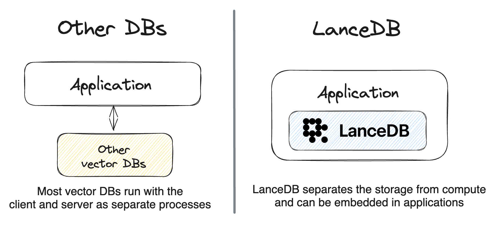

# Quick start

!!! info "LanceDB can be run in a number of ways:"

    * Embedded within an existing backend (like your Django, Flask, Node.js or FastAPI application)
    * Directly from a client application like a Jupyter notebook for analytical workloads
    * Deployed as a remote serverless database



## Installation

=== "Python"

      ```shell
      pip install lancedb
      ```

=== "Typescript[^1]"
    === "@lancedb/lancedb"

        ```shell
        npm install @lancedb/lancedb
        ```
        !!! note "Bundling `@lancedb/lancedb` apps with Webpack"

            Since LanceDB contains a prebuilt Node binary, you must configure `next.config.js` to exclude it from webpack. This is required for both using Next.js and deploying a LanceDB app on Vercel.

            ```javascript
            /** @type {import('next').NextConfig} */
            module.exports = ({
            webpack(config) {
                config.externals.push({ '@lancedb/lancedb': '@lancedb/lancedb' })
                return config;
            }
            })
            ```

        !!! note "Yarn users"

            Unlike other package managers, Yarn does not automatically resolve peer dependencies. If you are using Yarn, you will need to manually install 'apache-arrow':

            ```shell
            yarn add apache-arrow
            ```

    === "vectordb (deprecated)"

        ```shell
        npm install vectordb
        ```
        !!! note "Bundling `vectordb` apps with Webpack"

            Since LanceDB contains a prebuilt Node binary, you must configure `next.config.js` to exclude it from webpack. This is required for both using Next.js and deploying a LanceDB app on Vercel.

            ```javascript
            /** @type {import('next').NextConfig} */
            module.exports = ({
            webpack(config) {
                config.externals.push({ vectordb: 'vectordb' })
                return config;
            }
            })
            ```

        !!! note "Yarn users"

            Unlike other package managers, Yarn does not automatically resolve peer dependencies. If you are using Yarn, you will need to manually install 'apache-arrow':

            ```shell
            yarn add apache-arrow
            ```

=== "Rust"

    ```shell
    cargo add lancedb
    ```

    !!! info "To use the lancedb create, you first need to install protobuf."

    === "macOS"

        ```shell
        brew install protobuf
        ```

    === "Ubuntu/Debian"

        ```shell
        sudo apt install -y protobuf-compiler libssl-dev
        ```

    !!! info "Please also make sure you're using the same version of Arrow as in the [lancedb crate](https://github.com/lancedb/lancedb/blob/main/Cargo.toml)"

### Preview releases

Stable releases are created about every 2 weeks. For the latest features and bug
fixes, you can install the preview release. These releases receive the same
level of testing as stable releases, but are not guaranteed to be available for
more than 6 months after they are released. Once your application is stable, we
recommend switching to stable releases.

=== "Python"

      ```shell
      pip install --pre --extra-index-url https://pypi.fury.io/lancedb/ lancedb
      ```

=== "Typescript[^1]"

    === "@lancedb/lancedb"

        ```shell
        npm install @lancedb/lancedb@preview
        ```
    === "vectordb (deprecated)"

        ```shell
        npm install vectordb@preview
        ```

=== "Rust"

    We don't push preview releases to crates.io, but you can referent the tag
    in GitHub within your Cargo dependencies:

    ```toml
    [dependencies]
    lancedb = { git = "https://github.com/lancedb/lancedb.git", tag = "vX.Y.Z-beta.N" }
    ```

## Connect to a database

=== "Python"

    ```python
    --8<-- "python/python/tests/docs/test_basic.py:imports"
    --8<-- "python/python/tests/docs/test_basic.py:connect"

    --8<-- "python/python/tests/docs/test_basic.py:connect_async"
    ```

    !!! note "Asynchronous Python API"

        The asynchronous Python API is new and has some slight differences compared
        to the synchronous API.  Feel free to start using the asynchronous version.
        Once all features have migrated we will start to move the synchronous API to
        use the same syntax as the asynchronous API.  To help with this migration we
        have created a [migration guide](migration.md) detailing the differences.

=== "Typescript[^1]"

    === "@lancedb/lancedb"

        ```typescript
        import * as lancedb from "@lancedb/lancedb";
        import * as arrow from "apache-arrow";

        --8<-- "nodejs/examples/basic.ts:connect"
        ```

    === "vectordb (deprecated)"

        ```typescript
        --8<-- "docs/src/basic_legacy.ts:open_db"
        ```

=== "Rust"

    ```rust
    #[tokio::main]
    async fn main() -> Result<()> {
        --8<-- "rust/lancedb/examples/simple.rs:connect"
    }
    ```

    !!! info "See [examples/simple.rs](https://github.com/lancedb/lancedb/tree/main/rust/lancedb/examples/simple.rs) for a full working example."

LanceDB will create the directory if it doesn't exist (including parent directories).

If you need a reminder of the uri, you can call `db.uri()`.

## Create a table

### Create a table from initial data

If you have data to insert into the table at creation time, you can simultaneously create a
table and insert the data into it. The schema of the data will be used as the schema of the
table.

=== "Python"

    ```python
    --8<-- "python/python/tests/docs/test_basic.py:create_table"
    --8<-- "python/python/tests/docs/test_basic.py:create_table_async"
    ```

    If the table already exists, LanceDB will raise an error by default.
    If you want to overwrite the table, you can pass in `mode="overwrite"`
    to the `create_table` method.

    You can also pass in a pandas DataFrame directly:

    ```python
    --8<-- "python/python/tests/docs/test_basic.py:create_table_pandas"
    --8<-- "python/python/tests/docs/test_basic.py:create_table_async_pandas"
    ```

=== "Typescript[^1]"

    === "@lancedb/lancedb"

        ```typescript
        --8<-- "nodejs/examples/basic.ts:create_table"
        ```

    === "vectordb (deprecated)"

        ```typescript
        --8<-- "docs/src/basic_legacy.ts:create_table"
        ```

        If the table already exists, LanceDB will raise an error by default.
        If you want to overwrite the table, you can pass in `mode:"overwrite"`
        to the `createTable` function.

=== "Rust"

    ```rust
    --8<-- "rust/lancedb/examples/simple.rs:create_table"
    ```

    If the table already exists, LanceDB will raise an error by default.  See
    [the mode option](https://docs.rs/lancedb/latest/lancedb/connection/struct.CreateTableBuilder.html#method.mode)
    for details on how to overwrite (or open) existing tables instead.

    !!! Providing table records in Rust

        The Rust SDK currently expects data to be provided as an Arrow
        [RecordBatchReader](https://docs.rs/arrow-array/latest/arrow_array/trait.RecordBatchReader.html)
        Support for additional formats (such as serde or polars) is on the roadmap.

!!! info "Under the hood, LanceDB reads in the Apache Arrow data and persists it to disk using the [Lance format](https://www.github.com/lancedb/lance)."

!!! info "Automatic embedding generation with Embedding API"
    When working with embedding models, it is recommended to use the LanceDB embedding API to automatically create vector representation of the data and queries in the background. See the [quickstart example](#using-the-embedding-api) or the embedding API [guide](./embeddings/)

### Create an empty table

Sometimes you may not have the data to insert into the table at creation time.
In this case, you can create an empty table and specify the schema, so that you can add
data to the table at a later time (as long as it conforms to the schema). This is
similar to a `CREATE TABLE` statement in SQL.

=== "Python"

      ```python
      --8<-- "python/python/tests/docs/test_basic.py:create_empty_table"
      --8<-- "python/python/tests/docs/test_basic.py:create_empty_table_async"
      ```

    !!! note "You can define schema in Pydantic"
        LanceDB comes with Pydantic support, which allows you to define the schema of your data using Pydantic models. This makes it easy to work with LanceDB tables and data. Learn more about all supported types in [tables guide](./guides/tables.md).

=== "Typescript[^1]"

    === "@lancedb/lancedb"

        ```typescript
        --8<-- "nodejs/examples/basic.ts:create_empty_table"
        ```

    === "vectordb (deprecated)"

        ```typescript
        --8<-- "docs/src/basic_legacy.ts:create_empty_table"
        ```

=== "Rust"

    ```rust
    --8<-- "rust/lancedb/examples/simple.rs:create_empty_table"
    ```

## Open an existing table

Once created, you can open a table as follows:

=== "Python"

    ```python
    --8<-- "python/python/tests/docs/test_basic.py:open_table"
    --8<-- "python/python/tests/docs/test_basic.py:open_table_async"
    ```

=== "Typescript[^1]"
    === "@lancedb/lancedb"

        ```typescript
        --8<-- "nodejs/examples/basic.ts:open_table"
        ```

    === "vectordb (deprecated)"

        ```typescript
        const tbl = await db.openTable("myTable");
        ```


=== "Rust"

    ```rust
    --8<-- "rust/lancedb/examples/simple.rs:open_existing_tbl"
    ```

If you forget the name of your table, you can always get a listing of all table names:

=== "Python"

    ```python
    --8<-- "python/python/tests/docs/test_basic.py:table_names"
    --8<-- "python/python/tests/docs/test_basic.py:table_names_async"
    ```

=== "Typescript[^1]"
    === "@lancedb/lancedb"

        ```typescript
        --8<-- "nodejs/examples/basic.ts:table_names"
        ```

    === "vectordb (deprecated)"

        ```typescript
        console.log(await db.tableNames());
        ```

=== "Rust"

    ```rust
    --8<-- "rust/lancedb/examples/simple.rs:list_names"
    ```

## Add data to a table

After a table has been created, you can always add more data to it as follows:

=== "Python"

    ```python
    --8<-- "python/python/tests/docs/test_basic.py:add_data"
    --8<-- "python/python/tests/docs/test_basic.py:add_data_async"
    ```

=== "Typescript[^1]"
    === "@lancedb/lancedb"

        ```typescript
        --8<-- "nodejs/examples/basic.ts:add_data"
        ```

    === "vectordb (deprecated)"

        ```typescript
        --8<-- "docs/src/basic_legacy.ts:add"
        ```

=== "Rust"

    ```rust
    --8<-- "rust/lancedb/examples/simple.rs:add"
    ```

## Search for nearest neighbors

Once you've embedded the query, you can find its nearest neighbors as follows:

=== "Python"

    ```python
    --8<-- "python/python/tests/docs/test_basic.py:vector_search"
    --8<-- "python/python/tests/docs/test_basic.py:vector_search_async"
    ```

    This returns a pandas DataFrame with the results.

=== "Typescript[^1]"
    === "@lancedb/lancedb"

        ```typescript
        --8<-- "nodejs/examples/basic.ts:vector_search"
        ```

    === "vectordb (deprecated)"

        ```typescript
        --8<-- "docs/src/basic_legacy.ts:search"
        ```

=== "Rust"

    ```rust
    use futures::TryStreamExt;

    --8<-- "rust/lancedb/examples/simple.rs:search"
    ```

    !!! Query vectors in Rust
        Rust does not yet support automatic execution of embedding functions.  You will need to
        calculate embeddings yourself.  Support for this is on the roadmap and can be tracked at
        https://github.com/lancedb/lancedb/issues/994

        Query vectors can be provided as Arrow arrays or a Vec/slice of Rust floats.
        Support for additional formats (e.g. `polars::series::Series`) is on the roadmap.

By default, LanceDB runs a brute-force scan over dataset to find the K nearest neighbours (KNN).
For tables with more than 50K vectors, creating an ANN index is recommended to speed up search performance.
LanceDB allows you to create an ANN index on a table as follows:

=== "Python"

    ```py
    --8<-- "python/python/tests/docs/test_basic.py:create_index"
    --8<-- "python/python/tests/docs/test_basic.py:create_index_async"
    ```

=== "Typescript[^1]"
    === "@lancedb/lancedb"

        ```typescript
        --8<-- "nodejs/examples/basic.ts:create_index"
        ```

    === "vectordb (deprecated)"

        ```{.typescript .ignore}
        --8<-- "docs/src/basic_legacy.ts:create_index"
        ```

=== "Rust"

    ```rust
    --8<-- "rust/lancedb/examples/simple.rs:create_index"
    ```

!!! note "Why do I need to create an index manually?"
LanceDB does not automatically create the ANN index for two reasons. The first is that it's optimized
for really fast retrievals via a disk-based index, and the second is that data and query workloads can
be very diverse, so there's no one-size-fits-all index configuration. LanceDB provides many parameters
to fine-tune index size, query latency and accuracy. See the section on
[ANN indexes](ann_indexes.md) for more details.

## Delete rows from a table

Use the `delete()` method on tables to delete rows from a table. To choose
which rows to delete, provide a filter that matches on the metadata columns.
This can delete any number of rows that match the filter.

=== "Python"

    ```python
    --8<-- "python/python/tests/docs/test_basic.py:delete_rows"
    --8<-- "python/python/tests/docs/test_basic.py:delete_rows_async"
    ```

=== "Typescript[^1]"

    === "@lancedb/lancedb"

        ```typescript
        --8<-- "nodejs/examples/basic.ts:delete_rows"
        ```

    === "vectordb (deprecated)"

        ```typescript
        --8<-- "docs/src/basic_legacy.ts:delete"
        ```

=== "Rust"

    ```rust
    --8<-- "rust/lancedb/examples/simple.rs:delete"
    ```

The deletion predicate is a SQL expression that supports the same expressions
as the `where()` clause (`only_if()` in Rust) on a search. They can be as
simple or complex as needed. To see what expressions are supported, see the
[SQL filters](sql.md) section.

=== "Python"

      Read more: [lancedb.table.Table.delete][]

=== "Typescript[^1]"

    === "@lancedb/lancedb"

        Read more: [lancedb.Table.delete](javascript/interfaces/Table.md#delete)

    === "vectordb (deprecated)"

        Read more: [vectordb.Table.delete](javascript/interfaces/Table.md#delete)

=== "Rust"

      Read more: [lancedb::Table::delete](https://docs.rs/lancedb/latest/lancedb/table/struct.Table.html#method.delete)

## Drop a table

Use the `drop_table()` method on the database to remove a table.

=== "Python"

    ```python
    --8<-- "python/python/tests/docs/test_basic.py:drop_table"
    --8<-- "python/python/tests/docs/test_basic.py:drop_table_async"
    ```

    This permanently removes the table and is not recoverable, unlike deleting rows.
    By default, if the table does not exist an exception is raised. To suppress this,
    you can pass in `ignore_missing=True`.

=== "Typescript[^1]"

    === "@lancedb/lancedb"

        ```typescript
        --8<-- "nodejs/examples/basic.ts:drop_table"
        ```

    === "vectordb (deprecated)"

        ```typescript
        --8<-- "docs/src/basic_legacy.ts:drop_table"
        ```

        This permanently removes the table and is not recoverable, unlike deleting rows.
        If the table does not exist an exception is raised.

=== "Rust"

    ```rust
    --8<-- "rust/lancedb/examples/simple.rs:drop_table"
    ```


## Using the Embedding API
You can use the embedding API when working with embedding models. It automatically vectorizes the data at ingestion and query time and comes with built-in integrations with popular embedding models like Openai, Hugging Face, Sentence Transformers, CLIP and more.

=== "Python"

    ```python
    --8<-- "python/python/tests/docs/test_embeddings_optional.py:imports"
    --8<-- "python/python/tests/docs/test_embeddings_optional.py:openai_embeddings"
    ```

=== "Typescript[^1]"

    === "@lancedb/lancedb"

        ```typescript
        --8<-- "nodejs/examples/embedding.ts:imports"
        --8<-- "nodejs/examples/embedding.ts:openai_embeddings"
        ```

=== "Rust"

    ```rust
    --8<-- "rust/lancedb/examples/openai.rs:imports"
    --8<-- "rust/lancedb/examples/openai.rs:openai_embeddings"
    ```

Learn about using the existing integrations and creating custom embedding functions in the [embedding API guide](./embeddings/index.md).


## What's next

This section covered the very basics of using LanceDB. If you're learning about vector databases for the first time, you may want to read the page on [indexing](concepts/index_ivfpq.md) to get familiar with the concepts.

If you've already worked with other vector databases, you may want to read the [guides](guides/tables.md) to learn how to work with LanceDB in more detail.

[^1]: The `vectordb` package is a legacy package that is  deprecated in favor of `@lancedb/lancedb`.  The `vectordb` package will continue to receive bug fixes and security updates until September 2024.  We recommend all new projects use `@lancedb/lancedb`.  See the [migration guide](migration.md) for more information.
