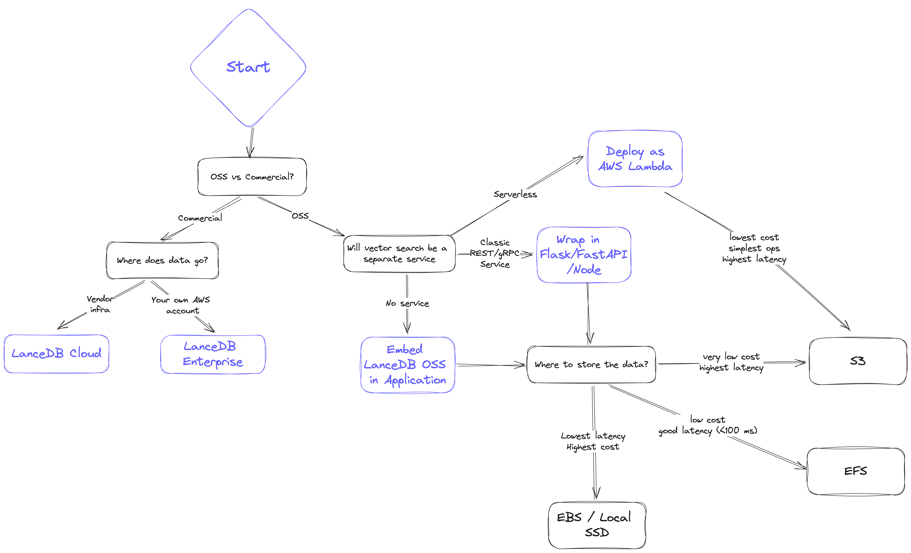

# Storage

LanceDB is among the only vector databases built on top of multiple modular components designed from the ground-up to be efficient on disk. This gives it the unique benefit of being flexible enough to support multiple storage backends, including local NVMe, EBS, EFS and many other third-party APIs that connect to the cloud.

It is important to understand the tradeoffs between cost and latency for your specific application and use case. This section will help you understand the tradeoffs between the different storage backends.

## Storage options

We've prepared a simple diagram to showcase the thought process that goes into choosing a storage backend when using LanceDB OSS, Cloud or Enterprise.

When architecting your system, you'd typically ask yourself the following questions to decide on a storage option:

1. **Latency**: How fast do I need results? What do the p50 and also p95 look like?
2. **Scalability**: Can I scale up the amount of data and QPS easily?
3. **Cost**: To serve my application, what’s the all-in cost of *both* storage and serving infra?
4. **Reliability/Availability**: How does replication work? Is disaster recovery addressed?

## Tradeoffs

This section reviews the characteristics of each storage option in four dimensions: latency, scalability, cost and reliability.

**We begin with the lowest cost option, and end with the lowest latency option.**

### 1. S3 / GCS / Azure Blob Storage

!!! tip "Lowest cost, highest latency"

    - **Latency** ⇒ Has the highest latency. p95 latency is also substantially worse than p50. In general you get results in the order of several hundred milliseconds
    - **Scalability** ⇒ Infinite on storage, however, QPS will be limited by S3 concurrency limits
    - **Cost** ⇒ Lowest (order of magnitude cheaper than other options)
    - **Reliability/Availability** ⇒ Highly available, as blob storage like S3 are critical infrastructure that form the backbone of the internet.

Another important point to note is that LanceDB is designed to separate storage from compute, and the underlying Lance format stores the data in numerous immutable fragments. Due to these factors, LanceDB is a great storage option that addresses the _N + 1_ query problem. i.e., when a high query throughput is required, query processes can run in a stateless manner and be scaled up and down as needed.

### 2. EFS / GCS Filestore / Azure File Storage

!!! info "Moderately low cost, moderately low latency (<100ms)"

    - **Latency** ⇒ Much better than object/blob storage but not as good as EBS/Local disk; < 100ms p95 achievable
    - **Scalability** ⇒ High, but the bottleneck will be the IOPs limit, but when scaling you can provision multiple EFS volumes
    - **Cost** ⇒ Significantly more expensive than S3 but still very cost effective compared to in-memory dbs. Inactive data in EFS is also automatically tiered to S3-level costs.
    - **Reliability/Availability** ⇒ Highly available, as query nodes can go down without affecting EFS.  However, EFS does not provide replication / backup - this must be managed manually.

A recommended best practice is to keep a copy of the data on S3 for disaster recovery scenarios. If any downtime is unacceptable, then you would need another EFS with a copy of the data. This is still much cheaper than EC2 instances holding multiple copies of the data.

### 3. Third-party storage solutions

Solutions like [MinIO](https://blog.min.io/lancedb-trusted-steed-against-data-complexity/), WekaFS, etc. that deliver S3 compatible API with much better performance than S3.

!!! info "Moderately low cost, moderately low latency (<100ms)"

    - **Latency** ⇒ Should be similar latency to EFS, better than S3 (<100ms)
    - **Scalability** ⇒ Up to the solutions architect, who can add as many nodes to their MinIO or other third-party provider's cluster as needed
    - **Cost** ⇒ Definitely higher than S3. The cost can be marginally higher than EFS until you get to maybe >10TB scale with high utilization
    - **Reliability/Availability** ⇒ These are all shareable by lots of nodes, quality/cost of replication/backup depends on the vendor

### 4. EBS / GCP Persistent Disk / Azure Managed Disk

!!! info "Very low latency (<30ms), higher cost"

    - **Latency** ⇒ Very good, pretty close to local disk. You’re looking at <30ms latency in most cases
    - **Scalability** ⇒ EBS is not shareable between instances. If deployed via k8s, it can be shared between pods that live on the same instance, but beyond that you would need to shard data or make an additional copy
    - **Cost** ⇒ Higher than EFS. There are some hidden costs to EBS as well if you’re paying for IO.
    - **Reliability/Availability** ⇒ Not shareable between instances but can be shared between pods on the same instance. Survives instance termination. No automatic backups.

Just like EFS, an EBS or persistent disk setup requires more manual work to manage data sharding, backups and capacity.

### 5. Local disk (SSD/NVMe)

!!! danger "Lowest latency (<10ms), highest cost"

    - **Latency** ⇒ Lowest latency with modern NVMe drives, <10ms p95
    - **Scalability** ⇒ Difficult to scale on cloud. Also need additional copies / sharding if QPS needs to be higher
    - **Cost** ⇒ Highest cost; the main issue with keeping your application and storage tightly integrated is that it’s just not really possible to scale this up in cloud environments
    - **Reliability/Availability** ⇒ If the instance goes down, so does your data. You have to be _very_ diligent about backing up your data

As a rule of thumb, local disk should be your storage option if you require absolutely *crazy low* latency and you’re willing to do a bunch of data management work to make it happen.
