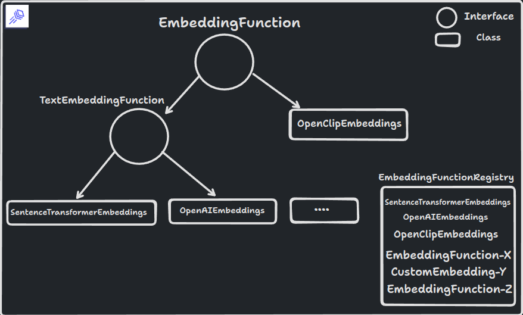

To use your own custom embedding function, you can follow these 2 simple steps:

1. Create your embedding function by implementing the `EmbeddingFunction` interface
2. Register your embedding function in the global `EmbeddingFunctionRegistry`.

Let us see how this looks like in action.



`EmbeddingFunction` and `EmbeddingFunctionRegistry` handle low-level details for serializing schema and model information as metadata. To build a custom embedding function, you don't have to worry about the finer details - simply focus on setting up the model and leave the rest to LanceDB.

## `TextEmbeddingFunction` interface

There is another optional layer of abstraction available: `TextEmbeddingFunction`. You can use this abstraction if your model isn't multi-modal in nature and only needs to operate on text. In such cases, both the source and vector fields will have the same work for vectorization, so you simply just need to setup the model and rest is handled by `TextEmbeddingFunction`. You can read more about the class and its attributes in the class reference.

Let's implement `SentenceTransformerEmbeddings` class. All you need to do is implement the `generate_embeddings()` and `ndims` function to handle the input types you expect and register the class in the global `EmbeddingFunctionRegistry`


=== "Python"

    ```python
    from lancedb.embeddings import register
    from lancedb.util import attempt_import_or_raise

    @register("sentence-transformers")
    class SentenceTransformerEmbeddings(TextEmbeddingFunction):
        name: str = "all-MiniLM-L6-v2"
        # set more default instance vars like device, etc.

        def __init__(self, **kwargs):
            super().__init__(**kwargs)
            self._ndims = None

        def generate_embeddings(self, texts):
            return self._embedding_model().encode(list(texts), ...).tolist()

        def ndims(self):
            if self._ndims is None:
                self._ndims = len(self.generate_embeddings("foo")[0])
            return self._ndims

        @cached(cache={})
        def _embedding_model(self):
            return sentence_transformers.SentenceTransformer(name)
    ```

=== "TypeScript"

    ```ts
    --8<--- "nodejs/examples/custom_embedding_function.ts:imports"

    --8<--- "nodejs/examples/custom_embedding_function.ts:embedding_impl"
    ```


This is a stripped down version of our implementation of `SentenceTransformerEmbeddings` that removes certain optimizations and default settings.

Now you can use this embedding function to create your table schema and that's it! you can then ingest data and run queries without manually vectorizing the inputs.

=== "Python"

    ```python
    from lancedb.pydantic import LanceModel, Vector

    registry = EmbeddingFunctionRegistry.get_instance()
    stransformer = registry.get("sentence-transformers").create()

    class TextModelSchema(LanceModel):
        vector: Vector(stransformer.ndims) = stransformer.VectorField()
        text: str = stransformer.SourceField()

    tbl = db.create_table("table", schema=TextModelSchema)

    tbl.add(pd.DataFrame({"text": ["halo", "world"]}))
    result = tbl.search("world").limit(5)
    ```

=== "TypeScript"

    ```ts
    --8<--- "nodejs/examples/custom_embedding_function.ts:call_custom_function"
    ```

!!! note

    You can always implement the `EmbeddingFunction` interface directly if you want or need to, `TextEmbeddingFunction` just makes it much simpler and faster for you to do so, by setting up the boiler plat for text-specific use case

## Multi-modal embedding function example
You can also use the `EmbeddingFunction` interface to implement more complex workflows such as multi-modal embedding function support.

=== "Python"

    LanceDB implements `OpenClipEmeddingFunction` class that suppports multi-modal seach. Here's the implementation that you can use as a reference to build your own multi-modal embedding functions.

    ```python
    @register("open-clip")
    class OpenClipEmbeddings(EmbeddingFunction):
        name: str = "ViT-B-32"
        pretrained: str = "laion2b_s34b_b79k"
        device: str = "cpu"
        batch_size: int = 64
        normalize: bool = True
        _model = PrivateAttr()
        _preprocess = PrivateAttr()
        _tokenizer = PrivateAttr()

        def __init__(self, *args, **kwargs):
            super().__init__(*args, **kwargs)
            open_clip = attempt_import_or_raise("open_clip", "open-clip") # EmbeddingFunction util to import external libs and raise if not found
            model, _, preprocess = open_clip.create_model_and_transforms(
                self.name, pretrained=self.pretrained
            )
            model.to(self.device)
            self._model, self._preprocess = model, preprocess
            self._tokenizer = open_clip.get_tokenizer(self.name)
            self._ndims = None

        def ndims(self):
            if self._ndims is None:
                self._ndims = self.generate_text_embeddings("foo").shape[0]
            return self._ndims

        def compute_query_embeddings(
            self, query: Union[str, "PIL.Image.Image"], *args, **kwargs
        ) -> List[np.ndarray]:
            """
            Compute the embeddings for a given user query

            Parameters
            ----------
            query : Union[str, PIL.Image.Image]
                The query to embed. A query can be either text or an image.
            """
            if isinstance(query, str):
                return [self.generate_text_embeddings(query)]
            else:
                PIL = attempt_import_or_raise("PIL", "pillow")
                if isinstance(query, PIL.Image.Image):
                    return [self.generate_image_embedding(query)]
                else:
                    raise TypeError("OpenClip supports str or PIL Image as query")

        def generate_text_embeddings(self, text: str) -> np.ndarray:
            torch = attempt_import_or_raise("torch")
            text = self.sanitize_input(text)
            text = self._tokenizer(text)
            text.to(self.device)
            with torch.no_grad():
                text_features = self._model.encode_text(text.to(self.device))
                if self.normalize:
                    text_features /= text_features.norm(dim=-1, keepdim=True)
                return text_features.cpu().numpy().squeeze()

        def sanitize_input(self, images: IMAGES) -> Union[List[bytes], np.ndarray]:
            """
            Sanitize the input to the embedding function.
            """
            if isinstance(images, (str, bytes)):
                images = [images]
            elif isinstance(images, pa.Array):
                images = images.to_pylist()
            elif isinstance(images, pa.ChunkedArray):
                images = images.combine_chunks().to_pylist()
            return images

        def compute_source_embeddings(
            self, images: IMAGES, *args, **kwargs
        ) -> List[np.array]:
            """
            Get the embeddings for the given images
            """
            images = self.sanitize_input(images)
            embeddings = []
            for i in range(0, len(images), self.batch_size):
                j = min(i + self.batch_size, len(images))
                batch = images[i:j]
                embeddings.extend(self._parallel_get(batch))
            return embeddings

        def _parallel_get(self, images: Union[List[str], List[bytes]]) -> List[np.ndarray]:
            """
            Issue concurrent requests to retrieve the image data
            """
            with concurrent.futures.ThreadPoolExecutor() as executor:
                futures = [
                    executor.submit(self.generate_image_embedding, image)
                    for image in images
                ]
                return [future.result() for future in futures]

        def generate_image_embedding(
            self, image: Union[str, bytes, "PIL.Image.Image"]
        ) -> np.ndarray:
            """
            Generate the embedding for a single image

            Parameters
            ----------
            image : Union[str, bytes, PIL.Image.Image]
                The image to embed. If the image is a str, it is treated as a uri.
                If the image is bytes, it is treated as the raw image bytes.
            """
            torch = attempt_import_or_raise("torch")
            # TODO handle retry and errors for https
            image = self._to_pil(image)
            image = self._preprocess(image).unsqueeze(0)
            with torch.no_grad():
                return self._encode_and_normalize_image(image)

        def _to_pil(self, image: Union[str, bytes]):
            PIL = attempt_import_or_raise("PIL", "pillow")
            if isinstance(image, bytes):
                return PIL.Image.open(io.BytesIO(image))
            if isinstance(image, PIL.Image.Image):
                return image
            elif isinstance(image, str):
                parsed = urlparse.urlparse(image)
                # TODO handle drive letter on windows.
                if parsed.scheme == "file":
                    return PIL.Image.open(parsed.path)
                elif parsed.scheme == "":
                    return PIL.Image.open(image if os.name == "nt" else parsed.path)
                elif parsed.scheme.startswith("http"):
                    return PIL.Image.open(io.BytesIO(url_retrieve(image)))
                else:
                    raise NotImplementedError("Only local and http(s) urls are supported")

        def _encode_and_normalize_image(self, image_tensor: "torch.Tensor"):
            """
            encode a single image tensor and optionally normalize the output
            """
            image_features = self._model.encode_image(image_tensor)
            if self.normalize:
                image_features /= image_features.norm(dim=-1, keepdim=True)
            return image_features.cpu().numpy().squeeze()
    ```

=== "TypeScript"

    Coming Soon! See this [issue](https://github.com/lancedb/lancedb/issues/1482) to track the status!
