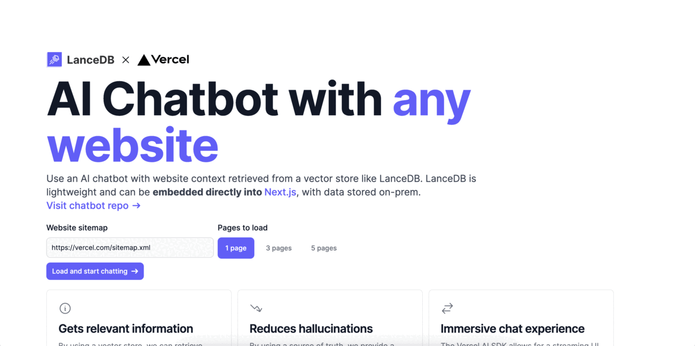

# Example projects and recipes

## Recipes and example code

LanceDB provides language APIs, allowing you to embed a database in your language of choice.

* 🐍 [Python](examples_python.md) examples
* 👾 [JavaScript](examples_js.md) examples
* 🦀 Rust examples (coming soon)

## Applications powered by LanceDB

| Project Name                                        | Description                                                                                                          | Screenshot                                |
|-----------------------------------------------------|----------------------------------------------------------------------------------------------------------------------|-------------------------------------------|
| [YOLOExplorer](https://github.com/lancedb/yoloexplorer) | Iterate on your YOLO / CV datasets using SQL, Vector semantic search, and more within seconds                  |  |
| [Website Chatbot (Deployable Vercel Template)](https://github.com/lancedb/lancedb-vercel-chatbot) | Create a chatbot from the sitemap of any website/docs of your choice. Built using vectorDB serverless native javascript package. |     |
