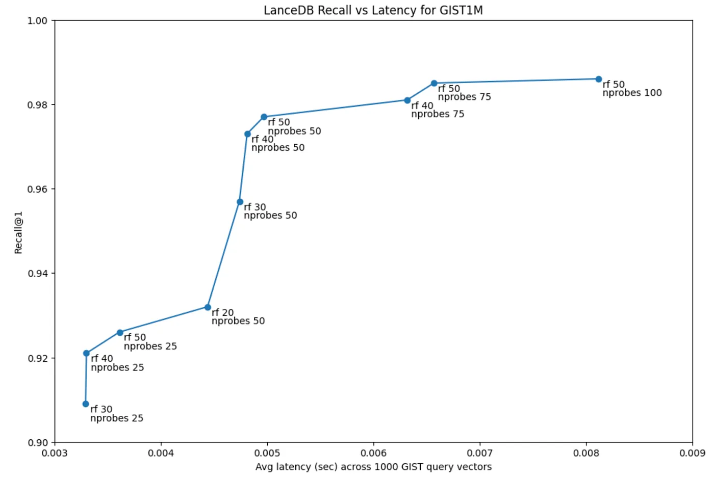

This section covers some common questions and issues that you may encounter when using LanceDB.

### Is LanceDB open source?

Yes, LanceDB is an open source vector database available under an Apache 2.0 license. We also have a serverless SaaS solution, LanceDB Cloud, available under a commercial license.

### What is the difference between Lance and LanceDB?

[Lance](https://github.com/lancedb/lance) is a modern columnar data format for AI, written in Rust 🦀. It’s perfect for building search engines, feature stores and being the foundation of large-scale ML training jobs requiring high performance IO and shuffles. It also has native support for storing, querying, and inspecting deeply nested data for robotics or large blobs like images, point clouds, and more.

LanceDB is the vector database that’s built on top of Lance, and utilizes the underlying optimized storage format to build efficient disk-based indexes that power semantic search & retrieval applications, from RAGs to QA Bots to recommender systems.

### Why invent another data format instead of using Parquet?

As we mention in our talk titled “[Lance, a modern columnar data format](https://www.youtube.com/watch?v=ixpbVyrsuL8)”, Parquet and other tabular formats that derive from it are rather dated (Parquet is over 10 years old), especially when it comes to random access on vectors. We needed a format that’s able to handle the complex trade-offs involved in shuffling, scanning, OLAP and filtering large datasets involving vectors, and our extensive experiments with Parquet didn't yield sufficient levels of performance for modern ML. [Our benchmarks](https://blog.lancedb.com/benchmarking-random-access-in-lance-ed690757a826) show that Lance is up to 1000x faster than Parquet for random access, which we believe justifies our decision to create a new data format for AI.

### Why build in Rust? 🦀

We believe that the Rust ecosystem has attained mainstream maturity and that Rust will form the underpinnings of large parts of the data and ML landscape in a few years. Performance, latency and reliability are paramount to a vector DB, and building in Rust allows us to iterate and release updates more rapidly due to Rust’s safety guarantees. Both Lance (the data format) and LanceDB (the database) are written entirely in Rust. We also provide Python and JavaScript client libraries to interact with the database. Our Rust API is a little rough around the edges right now, but is fast becoming on par with the Python and JS APIs.

### What is the difference between LanceDB OSS and LanceDB Cloud?

LanceDB OSS is an **embedded** (in-process) solution that can be used as the vector store of choice for your LLM and RAG applications. It can be embedded inside an existing application backend, or used in-process alongside existing ML and data engineering pipelines.

LanceDB Cloud is a **serverless** solution — the database and data sit on the cloud and we manage the scalability of the application side via a remote client, without the need to manage any infrastructure.

Both flavors of LanceDB benefit from the blazing fast Lance data format and are built on the same open source foundations.

### What makes LanceDB different?

LanceDB is among the few embedded vector DBs out there that we believe can unlock a whole new class of LLM-powered applications in the browser or via edge functions. Lance’s multi-modal nature allows you to store the raw data, metadata and the embeddings all at once, unlike other solutions that typically store just the embeddings and metadata.

The Lance data format that powers our storage system also provides true zero-copy access and seamless interoperability with numerous other data formats (like Pandas, Polars, Pydantic) via Apache Arrow, as well as automatic data versioning and data management without needing extra infrastructure.

### How large of a dataset can LanceDB handle?

LanceDB and its underlying data format, Lance, are built to scale to really large amounts of data (hundreds of terabytes). We are currently working with customers who regularly perform operations on 200M+ vectors, and we’re fast approaching billion scale and beyond, which are well-handled by our disk-based indexes, without you having to break the bank.

### Do I need to build an ANN index to run vector search?

No. LanceDB is blazing fast (due to its disk-based index) for even brute force kNN search, within reason. In our benchmarks, computing 100K pairs of 1000-dimension vectors takes less than 20ms. For small datasets of ~100K records or applications that can accept ~100ms latency, an ANN index is usually not necessary.

For large-scale (>1M) or higher dimension vectors, it is beneficial to create an ANN index.

### Does LanceDB support full-text search?

Yes, LanceDB supports full-text search (FTS) via [Tantivy](https://github.com/quickwit-oss/tantivy). Our current FTS integration is Python-only, and our goal is to push it down to the Rust level in future versions to enable much more powerful search capabilities available to our Python, JavaScript and Rust clients.

### How can I speed up data inserts?

It's highly recommend to perform bulk inserts via batches (for e.g., Pandas DataFrames or lists of dicts in Python) to speed up inserts for large datasets. Inserting records one at a time is slow and can result in suboptimal performance because each insert creates a new data fragment on disk. Batching inserts allows LanceDB to create larger fragments (and their associated manifests), which are more efficient to read and write.

### Do I need to set a refine factor when using an index?

Yes. LanceDB uses PQ, or Product Quantization, to compress vectors and speed up search when using an ANN index. However, because PQ is a lossy compression algorithm, it tends to reduce recall while also reducing the index size. To address this trade-off, we introduce a process called **refinement**. The normal process computes distances by operating on the compressed PQ vectors. The refinement factor (*rf*) is a multiplier that takes the top-k similar PQ vectors to a given query, fetches `rf * k` *full* vectors and computes the raw vector distances between them and the query vector, reordering the top-k results based on these scores instead.

For example, if you're retrieving the top 10 results and set `refine_factor` to 25, LanceDB will fetch the 250 most similar vectors (according to PQ), compute the distances again based on the full vectors for those 250 and then re-rank based on their scores. This can significantly improve recall, with a small added latency cost (typically a few milliseconds), so it's recommended you set a `refine_factor` of anywhere between 5-50 and measure its impact on latency prior to deploying your solution.

### How can I improve IVF-PQ recall while keeping latency low?

When using an IVF-PQ index, there's a trade-off between recall and latency at query time. You can improve recall by increasing the number of probes and the `refine_factor`. In our benchmark on the GIST-1M dataset, we show that it's possible to achieve >0.95 recall with a latency of under 10 ms on most systems, using ~50 probes and a `refine_factor` of 50. This is, of course, subject to the dataset at hand and a quick sensitivity study can be performed on your own data. You can find more details on the benchmark in our [blog post](https://blog.lancedb.com/benchmarking-lancedb-92b01032874a).



### How do I connect to MinIO?

MinIO supports an S3 compatible API. In order to connect to a MinIO instance, you need to:

- Set the envvar `AWS_ENDPOINT` to the URL of your MinIO API
- Set the envvars `AWS_ACCESS_KEY_ID` and `AWS_SECRET_ACCESS_KEY` with your MinIO credential
- Call `lancedb.connect("s3://minio_bucket_name")`

### Where can I find benchmarks for LanceDB?

Refer to this [post](https://blog.lancedb.com/benchmarking-lancedb-92b01032874a) for recent benchmarks.

### How much data can LanceDB practically manage without effecting performance?

We target good performance on ~10-50 billion rows and ~10-30 TB of data.

### Does LanceDB support concurrent operations?

LanceDB can handle concurrent reads very well, and can scale horizontally. The main constraint is how well the [storage layer](https://lancedb.github.io/lancedb/concepts/storage/) you've chosen scales. For writes, we support concurrent writing, though too many concurrent writers can lead to failing writes as there is a limited number of times a writer retries a commit

!!! info "Multiprocessing with LanceDB"

    For multiprocessing you should probably not use ```fork``` as lance is multi-threaded internally and ```fork``` and multi-thread do not work well.[Refer to this discussion](https://discuss.python.org/t/concerns-regarding-deprecation-of-fork-with-alive-threads/33555)
