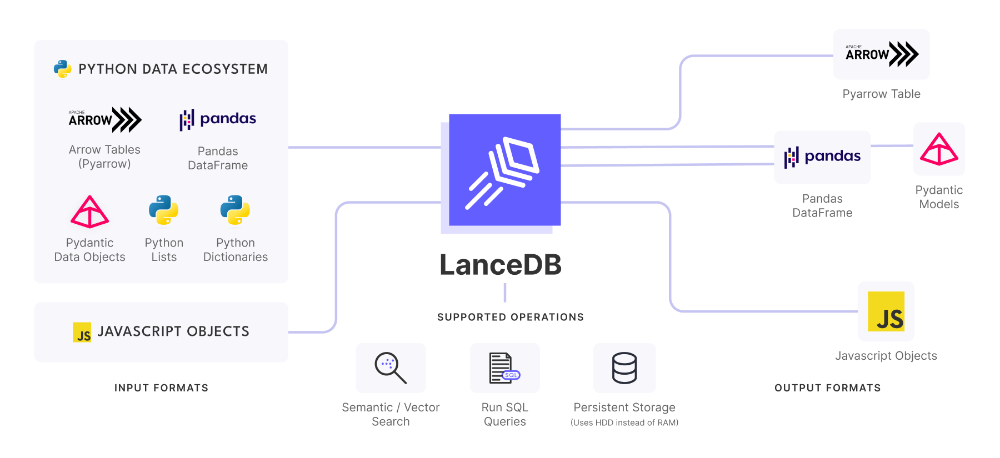

# Integrations

LanceDB supports ingesting from and exporting to your favorite data formats across the Python and JavaScript ecosystems.

## Tools

LanceDB is integrated with a lot of popular AI tools, with more coming soon.
Get started using these examples and quick links.

| Integrations | |
|---|---:|
| <h3> LlamaIndex </h3>LlamaIndex is a simple, flexible data framework for connecting custom data sources to large language models. Llama index integrates with LanceDB as the serverless VectorDB. <h3>[Lean More](https://gpt-index.readthedocs.io/en/latest/examples/vector_stores/LanceDBIndexDemo.html) </h3> ||
| <h3>Langchain</h3>Langchain allows building applications with LLMs through composability <h3>[Lean More](https://python.langchain.com/en/latest/modules/indexes/vectorstores/examples/lancedb.html) | |
| <h3>Langchain TS</h3> Javascript bindings for Langchain. It integrates with LanceDB's serverless vectordb allowing you to build powerful AI applications through composibility using only serverless functions. <h3>[Learn More]( https://js.langchain.com/docs/modules/data_connection/vectorstores/integrations/lancedb) | |
| <h3>Voxel51</h3>  It is an open source toolkit that enables you to build better computer vision workflows by improving the quality of your datasets and delivering insights about your models.<h3>[Learn More](./voxel51.md) | |
| <h3>PromptTools</h3>  Offers a set of free, open-source tools for testing and experimenting with models, prompts, and configurations. The core idea is to enable developers to evaluate prompts using familiar interfaces like code and notebooks. You can use it to experiment with different configurations of LanceDB, and test how LanceDB integrates with the LLM of your choice.<h3>[Learn More](./prompttools.md) | |
