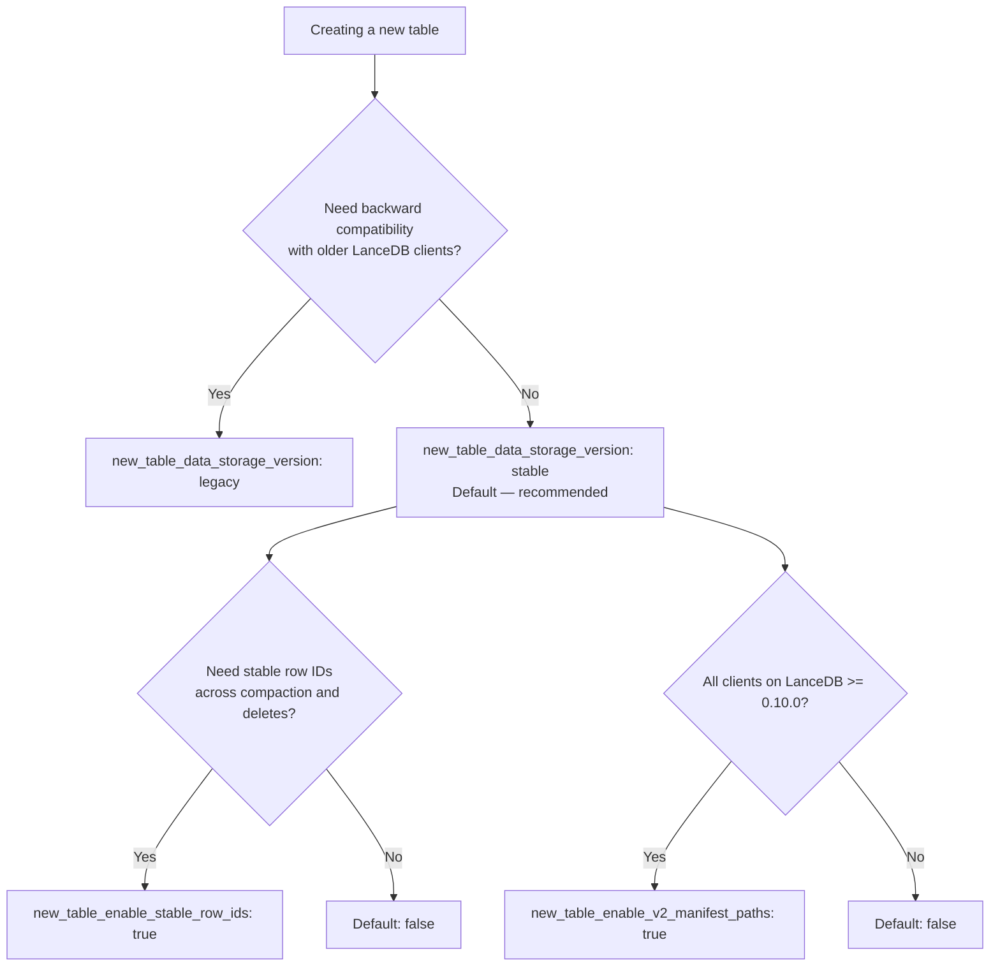

This page is about the embedded library, where your connection chooses and
configures the storage backend. A LanceDB Enterprise deployment sets up its own
storage when it is deployed, so a `db://` connection passes none of these
options except an Azure storage account name -- see
[Deployment](/enterprise/deployment) for how a deployment is set up.

LanceDB's storage layer is built on modular, disk-first components. That design makes it flexible enough to run across local NVMe, EBS, EFS, and any object store that exposes an S3-compatible API. It also supports region-specific backends such as [Tencent COS](/storage/configuration#tencent-cos) and cache-acceleration layers such as [GooseFS](/storage/configuration#goosefs).

Choosing a backend is a balance between latency, scalability, cost, and operational complexity. Use this guide to pick the right fit for your workload.

## Choosing a backend {#choosing}


When architecting your system, ask yourself:

- **Latency**: How fast do I need results? What do the p50 and p95 look like?
- **Scalability**: Can I scale data volume and QPS easily?
- **Cost**: What is the all-in cost of storage plus serving?
- **Reliability/Availability**: How will replication and disaster recovery work?

### Comparison {#comparison}

Below is a high-level comparison ordered from lowest cost to lowest latency.

### 1\. Object storage (S3, GCS, Azure Blob) {#1-object-storage-s3-gcs-azure-blob}
- **Latency**: Highest; expect hundreds of milliseconds and higher p95.
- **Scalability**: Effectively unlimited storage; QPS bound by concurrency limits.
- **Cost**: Lowest overall.
- **Reliability/Availability**: Highly available, backed by cloud SLAs.

LanceDB separates storage and compute and writes immutable fragments, making it a strong fit for stateless, horizontally scalable deployments.

<Note>
**Concurrent writers on S3**

S3 and S3 Express now support atomic writes natively, so LanceDB handles concurrent writers against the same table out-of-the-box — no external commit coordinator is required. Bucket-level [server-side encryption with KMS](/storage/configuration#server-side-encryption-with-kms) and [S3 Express One Zone](/storage/configuration#s3-express) are also supported on this tier.
</Note>

### 2\. File storage (EFS, GCS Filestore, Azure File) {#2-file-storage-efs-gcs-filestore-azure-file}
- **Latency**: Better than object storage; p95 under ~&lt;100ms is typical.
- **Scalability**: High, but limited by provisioned IOPS per volume.
- **Cost**: More than object storage but cheaper than in-memory options; cold data can tier down automatically.
- **Reliability/Availability**: Highly available; replication/backup must be managed separately.

Keep a copy of data in object storage for disaster recovery. If zero downtime is required, provision a second network file system with replicated data.

### 3\. Third-party storage (e.g., MinIO, WekaFS) {#3-third-party-storage-e-g--minio-wekafs}

- **Latency**: Similar to EFS; typically under &lt;100ms.
- **Scalability**: Determined by the chosen vendor’s cluster sizing.
- **Cost**: Higher than S3; may edge above EFS at larger scales.
- **Reliability/Availability**: Shareable across many nodes; replication depends on vendor capabilities.

### 4\. Block storage (EBS, GCP Persistent Disk, Azure Managed Disk) {#4-block-storage-ebs-gcp-persistent-disk-azure-managed-disk}
- **Latency**: Near-local performance; often &lt;30ms.
- **Scalability**: Not shareable across instances; shard or copy data when scaling.
- **Cost**: Higher than networked file systems, plus potential I/O charges.
- **Reliability/Availability**: Persists through instance restarts; backups and sharding must be managed.

### 5\. Local storage (SSD, NVMe) {#5-local-storage-ssd-nvme}
- **Latency**: Fastest; p95 often under &lt;10ms.
- **Scalability**: Hard to scale in cloud environments; requires sharding or additional copies for higher QPS.
- **Cost**: Highest; tightly coupling compute and storage makes horizontal scaling difficult.
- **Reliability/Availability**: Data is tied to the instance; backups must be rigorous.

Use local disk only when you need extremely low latency and are comfortable owning the operational overhead.

### File-format choices that interact with the backend {#file-format-choices}

A few `storage_options` keys shape new tables in ways that depend on the backend you picked above. They are documented in full on [below](#new-table-configuration); the architecture-level summary is:

- `new_table_enable_v2_manifest_paths` matters most on object stores, where opening a table with many versions is dominated by listing cost. Leave it off for backward compatibility with clients older than LanceDB 0.10.0.
- `new_table_enable_stable_row_ids` keeps row IDs stable across compaction, delete, and merge. The choice is independent of the backend but affects any system that joins on row ID.
- `new_table_data_storage_version` selects the on-disk format. The default `stable` is recommended for all new tables; pick `legacy` only when older readers must keep working.

import {
    PyStorageAzureAccount,
    PyStorageAzureSas,
    PyStorageConnectAzure,
    PyStorageConnectGcs,
    PyStorageConnectS3,
    PyStorageConnectTimeout,
    PyStorageGcsServiceAccount,
    PyStorageS3Express,
    PyStorageS3Minio,
    PyStorageS3SseKms,
    PyStorageTableTimeout,
    PyStorageTigrisConnect,
    PyStorageCosConnect,
    PyStorageGoosefsConnect,
    TsStorageAzureAccount,
    TsStorageAzureSas,
    TsStorageConnectAzure,
    TsStorageConnectGcs,
    TsStorageConnectS3,
    TsStorageConnectTimeout,
    TsStorageGcsServiceAccount,
    TsStorageS3Express,
    TsStorageS3Minio,
    TsStorageS3SseKms,
    TsStorageTableTimeout,
    TsStorageTigrisConnect,
    TsStorageGoosefsConnect,
} from '/snippets/storage.mdx';

### Configuring a backend {#configuring}

<Note>
**LanceDB Enterprise storage configuration**

In LanceDB Enterprise, you connect with `db://...` and the cluster owns the storage credentials, so `storage_options` are not passed at runtime. Cloud auth is set at deployment time. For federated databases, the namespace service vends per-request credentials automatically. See the [quickstart](/quickstart), [Enterprise overview](/enterprise/), and [Azure deployment guide](/enterprise/deployment/azure) for the Enterprise flow.
</Note>

### Object stores {#object-stores}

LanceDB supports AWS S3 (and compatible stores), Azure Blob Storage, and Google Cloud Storage. The URI scheme in your `connect` call selects the backend.

<CodeGroup>
    <CodeBlock filename="Python" language="Python" icon="python">
    {PyStorageConnectS3}
    </CodeBlock>
    <CodeBlock filename="TypeScript" language="TypeScript" icon="square-js">
    {TsStorageConnectS3}
    </CodeBlock>
</CodeGroup>

<CodeGroup>
    <CodeBlock filename="Python" language="Python" icon="python">
    {PyStorageConnectGcs}
    </CodeBlock>
    <CodeBlock filename="TypeScript" language="TypeScript" icon="square-js">
    {TsStorageConnectGcs}
    </CodeBlock>
</CodeGroup>

<CodeGroup>
    <CodeBlock filename="Python" language="Python" icon="python">
    {PyStorageConnectAzure}
    </CodeBlock>
    <CodeBlock filename="TypeScript" language="TypeScript" icon="square-js">
    {TsStorageConnectAzure}
    </CodeBlock>
</CodeGroup>

### Configuration options {#configuration-options}

When running inside the target cloud with correct IAM bindings, LanceDB often needs no extra configuration. When running elsewhere, provide credentials via environment variables or `storage_options`.

<CodeGroup>
    <CodeBlock filename="Python" language="Python" icon="python">
    {PyStorageConnectTimeout}
    </CodeBlock>
    <CodeBlock filename="TypeScript" language="TypeScript" icon="square-js">
    {TsStorageConnectTimeout}
    </CodeBlock>
</CodeGroup>

<Info>
**Storage option casing**

Keys are case-insensitive. Use lowercase in `storage_options` and uppercase in environment variables.
</Info>

Table-level `storage_options` inherit every key from the connection and override on a per-key basis. Pass them to `create_table` or `open_table` for options that should apply to a single table:

<CodeGroup>
    <CodeBlock filename="Python" language="Python" icon="python">
    {PyStorageTableTimeout}
    </CodeBlock>
    <CodeBlock filename="TypeScript" language="TypeScript" icon="square-js">
    {TsStorageTableTimeout}
    </CodeBlock>
</CodeGroup>

<Tip>
**Inspect the effective options**

On `AsyncTable`, `await table.initial_storage_options()` returns the options the table was opened with, and `await table.latest_storage_options()` returns the current options after any provider-driven refresh. The deprecated `table.storage_options()` method will be removed in a future release.
</Tip>

#### General object store options {#general-object-store-options}

| Key | Description |
| :-- | :-- |
| `allow_http` | Allow non-TLS connections. |
| `allow_invalid_certificates` | Skip certificate validation for TLS connections. |
| `connect_timeout` | Timeout for the connect phase. |
| `timeout` | Timeout for the full request. |
| `user_agent` | User agent string sent with requests. |
| `proxy_url` | Proxy URL to route requests through. |
| `proxy_ca_certificate` | PEM-formatted CA certificate for proxy connections. |
| `proxy_excludes` | Comma-separated hosts that bypass the proxy (domains or CIDR). |
| `download_retry_count` | Number of retries when downloading objects. |
| `client_max_retries` | Maximum retries for object-store client requests. |
| `client_retry_timeout` | Total retry timeout (seconds) for object-store client requests. |

<Info>
**Option support varies by backend**

These are commonly used options. Cloud-specific keys (for example `region`, `endpoint`, `service_account`, and Azure credential keys) are backend-dependent and can be provided in `storage_options` as needed.
</Info>

#### New table configuration {#new-table-configuration}

These options control the Lance file format and features used when creating new tables. Pass them via `storage_options` at connection or table level. They are evaluated only at table creation; setting them on an existing connection does not rewrite or alter tables that already exist.

| Key | Values | Default | Description |
| :-- | :-- | :-- | :-- |
| `new_table_data_storage_version` | `legacy`, `stable` | `stable` | Lance file format version for new tables. Use `legacy` for backward compatibility with older clients, or `stable` for the current format with better performance. |
| `new_table_enable_v2_manifest_paths` | `true`, `false` | `false` | Use v2 manifest path naming. Requires LanceDB >= 0.10.0 to read. |
| `new_table_enable_stable_row_ids` | `true`, `false` | `false` | Keep row IDs stable across compaction, delete, and merge operations. |



<CodeGroup>
```python Python icon="python"
import lancedb

# Set the Lance file format version at connection level
db = lancedb.connect(
    "s3://bucket/path",
    storage_options={
        "new_table_data_storage_version": "stable",
    },
)
```

```typescript TypeScript icon="square-js"
import * as lancedb from "@lancedb/lancedb";

// Set the Lance file format version at connection level
const db = await lancedb.connect("s3://bucket/path", {
  storageOptions: {
    newTableDataStorageVersion: "stable",
  },
});
```
</CodeGroup>

<Warning>
**Deprecated parameter**

The `data_storage_version` parameter on `create_table()` is deprecated. Use `new_table_data_storage_version` in `storage_options` instead.
</Warning>

### AWS S3 {#aws-s3}


Set `AWS_ACCESS_KEY_ID`, `AWS_SECRET_ACCESS_KEY`, and optionally `AWS_SESSION_TOKEN` as environment variables or pass them in `storage_options`. Region is optional for AWS but required for most S3-compatible stores.

Minimum permissions usually include `s3:PutObject`, `s3:GetObject`, `s3:DeleteObject`, `s3:ListBucket`, and `s3:GetBucketLocation` scoped to the relevant bucket/prefix.

### S3-compatible stores {#s3-compatible-stores}

<CodeGroup>
    <CodeBlock filename="Python" language="Python" icon="python">
    {PyStorageS3Minio}
    </CodeBlock>
    <CodeBlock filename="TypeScript" language="TypeScript" icon="square-js">
    {TsStorageS3Minio}
    </CodeBlock>
</CodeGroup>

If the endpoint is `http://` (common in local development), also set `ALLOW_HTTP=true` or pass `allow_http=True` in `storage_options`.

### S3 Express {#s3-express}

<CodeGroup>
    <CodeBlock filename="Python" language="Python" icon="python">
    {PyStorageS3Express}
    </CodeBlock>
    <CodeBlock filename="TypeScript" language="TypeScript" icon="square-js">
    {TsStorageS3Express}
    </CodeBlock>
</CodeGroup>

Consult AWS networking requirements for S3 Express before enabling.

<Tip>
**Clean up failed multipart uploads**

LanceDB aborts multipart uploads on graceful shutdown, but crashes can leave incomplete uploads. Add an S3 lifecycle rule to delete in-progress uploads after a few days.
</Tip>

### Server-side encryption with KMS {#server-side-encryption-with-kms}

To encrypt at rest with an AWS KMS key, set `aws_server_side_encryption` to `aws:kms` and `aws_sse_kms_key_id` to the key ID or ARN. The same options apply at connection or table level and combine with bucket-level default encryption.

<CodeGroup>
    <CodeBlock filename="Python" language="Python" icon="python">
    {PyStorageS3SseKms}
    </CodeBlock>
    <CodeBlock filename="TypeScript" language="TypeScript" icon="square-js">
    {TsStorageS3SseKms}
    </CodeBlock>
</CodeGroup>

The IAM principal needs `kms:Encrypt`, `kms:Decrypt`, and `kms:GenerateDataKey` on the configured KMS key.

### Google Cloud Storage {#google-cloud-storage}


Provide credentials via `GOOGLE_SERVICE_ACCOUNT` (path to JSON) or include the path in `storage_options`. GCS defaults to HTTP/1; set `HTTP1_ONLY=false` if you need HTTP/2.

<CodeGroup>
    <CodeBlock filename="Python" language="Python" icon="python">
    {PyStorageGcsServiceAccount}
    </CodeBlock>
    <CodeBlock filename="TypeScript" language="TypeScript" icon="square-js">
    {TsStorageGcsServiceAccount}
    </CodeBlock>
</CodeGroup>

### Azure Blob Storage {#azure-blob-storage}


Set `AZURE_STORAGE_ACCOUNT_NAME` and `AZURE_STORAGE_ACCOUNT_KEY` as environment variables, or pass them via `storage_options`.

<CodeGroup>
    <CodeBlock filename="Python" language="Python" icon="python">
    {PyStorageAzureAccount}
    </CodeBlock>
    <CodeBlock filename="TypeScript" language="TypeScript" icon="square-js">
    {TsStorageAzureAccount}
    </CodeBlock>
</CodeGroup>

For SAS-token auth, set `azure_storage_account_name` and `azure_storage_sas_token`:

<CodeGroup>
    <CodeBlock filename="Python" language="Python" icon="python">
    {PyStorageAzureSas}
    </CodeBlock>
    <CodeBlock filename="TypeScript" language="TypeScript" icon="square-js">
    {TsStorageAzureSas}
    </CodeBlock>
</CodeGroup>

Other supported keys include service principal credentials (`azure_client_id`, `azure_client_secret`, `azure_tenant_id`), managed identities, and custom endpoints.

### Tigris Object Storage {#tigris-object-storage}


Tigris exposes an S3-compatible API. Configure the endpoint and region:

<CodeGroup>
    <CodeBlock filename="Python" language="Python" icon="python">
    {PyStorageTigrisConnect}
    </CodeBlock>
    <CodeBlock filename="TypeScript" language="TypeScript" icon="square-js">
    {TsStorageTigrisConnect}
    </CodeBlock>
</CodeGroup>

Environment variables `AWS_ENDPOINT=https://t3.storage.dev` and `AWS_DEFAULT_REGION=auto` achieve the same configuration.

### Tencent COS {#tencent-cos}

[Tencent Cloud Object Storage (COS)](https://www.tencentcloud.com/products/cos) is the primary object store for workloads running in the China region. Use the `cos://` URI scheme to connect directly to a COS bucket.

<CodeGroup>
    <CodeBlock filename="Python" language="Python" icon="python">
    {PyStorageCosConnect}
    </CodeBlock>
</CodeGroup>

Supported keys include `secret_id`, `secret_key`, `region`, and `endpoint`. You can also authenticate via the `TENCENTCLOUD_SECRET_ID` and `TENCENTCLOUD_SECRET_KEY` environment variables.

<Note>
**Availability**

COS is bundled in the Python wheel by default. To use it from Rust or the Node binding, build with the `cos` Cargo feature enabled.
</Note>

### GooseFS {#goosefs}

[GooseFS](https://www.tencentcloud.com/document/product/1424) is Tencent Cloud's distributed cache acceleration layer for COS and S3. It is a common choice when the same hot dataset is read repeatedly, such as vector search and AI training workloads. Connect using the `goosefs://` URI scheme.

<CodeGroup>
    <CodeBlock filename="Python" language="Python" icon="python">
    {PyStorageGoosefsConnect}
    </CodeBlock>
    <CodeBlock filename="TypeScript" language="TypeScript" icon="square-js">
    {TsStorageGoosefsConnect}
    </CodeBlock>
</CodeGroup>

GooseFS reads credentials and endpoint configuration from the GooseFS client environment. See the [GooseFS documentation](https://www.tencentcloud.com/document/product/1424) for cluster setup.

<Note>
**Availability**

GooseFS is bundled by default in the Python wheel and the Node binding. To use it from Rust, build with the `goosefs` Cargo feature enabled.
</Note>
